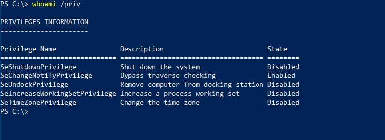
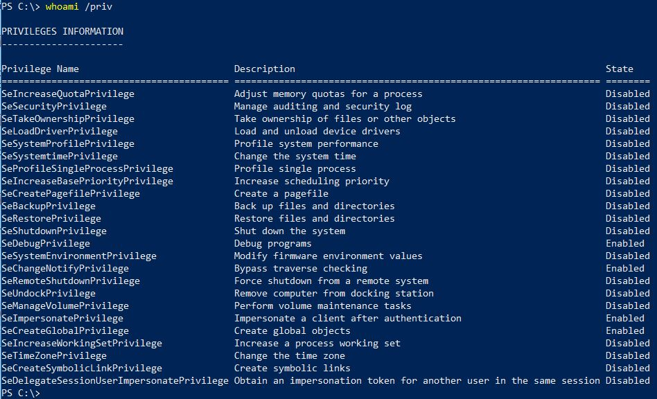

# UAC Bypass

## Checking permissons

First need to check if you are in a Medium Integrity process is to run the command `whoami /priv` and see if all privileges are available. 

The image above depicts a medium integrity process, as you can see, it does not have all privileges. 

When you start something “As Administrator”, and run whoami /priv, you will find out that there is a lot more. 

## Exploitation

Consider using [UACME](../../tools/uacme.md), [Metasploit Modules](../metasploit-modules.md#bypassuac) or [Bypass-UAC](../../tools/bypass-uac.md)

